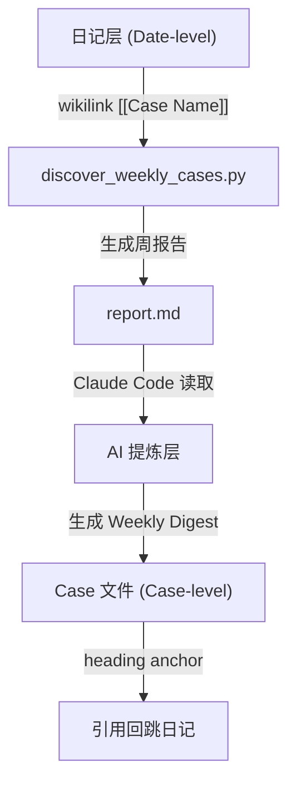

# case-weekly-digest

每周自动扫描 Obsidian 日记，发现并提取 case 相关更新，生成结构化报告供 Claude Code 进行 AI 提炼与归档。

## 背景

在 Obsidian 知识库中同时维护：
- **日记**（date-level）: `♻️复盘/01 日记/🎨YYYY_WKWW_DX_YYYY-MM-DD.md`
- **Case 文件**（case-level）: `10 🎯 Project/` 与 `20 🥅 Area/` 下的项目/事件笔记

痛点：日记中记录了 case 进展后，需要手动复制到 case 文件中，容易遗漏且费时。本工具通过"**Python 自动发现 + Claude Code 每周提炼**"的架构，实现零手动同步。

## 两段式工作流

```
┌─────────────────────────────────────┐
│  1. discover_weekly_cases.py        │
│     - 扫描本周日记                  │
│     - 自动发现提及的 case           │
│     - 提取相关段落与上下文          │
│     - 生成 .claude/case-weekly/     │
│       YYYY-WWW_report.md            │
└──────────────┬──────────────────────┘
               │
               ▼
┌─────────────────────────────────────┐
│  2. Claude Code 会话                │
│     - 读取生成的 report.md          │
│     - 为每个 case 生成 Weekly Digest│
│     - 追加到对应 case 文件末尾      │
└─────────────────────────────────────┘
```

## 安装

```bash
uv sync
```

## 使用

### 1. 生成本周报告

```bash
uv run discover_weekly_cases.py
```

输出示例：
```
Report generated: .claude/case-weekly/2026-W14_report.md
```

### 2. AI 提炼与归档

打开 Claude Code，运行：

```
请根据 .claude/case-weekly/2026-W14_report.md，为每个 case 生成 Weekly Digest 并追加到对应的 case 文件末尾。
```

Claude Code 将自动阅读报告，提炼关键进展、待办/阻塞项，并按统一格式归档到各 case 笔记中。

### 3. 补录历史周报

```bash
# 指定日期范围
uv run discover_weekly_cases.py --since 2026-03-01 --until 2026-03-31
```

## 报告格式

生成的 markdown 报告按 case 分组，每个 case 下再按日期和 heading 细分，便于 Claude Code 精准提炼：

```markdown
# Weekly Case Snapshot 2026-W14

## Case: Operation-PDX-IPS3 Gen12 Source Plan
### 2026-04-02 @ 🏐杂事
- [[Operation-PDX-IPS3 Gen12 Source Plan]] ...
    - ...

### 2026-04-03 @ 📌重要
- [[Operation-PDX-IPS3 Gen12 Source Plan]] ...
```

## 归档示例

追加到 case 文件末尾的内容样例：

```markdown
## 📓log (Auto) – Weekly Digest 2026-W14
> 归档时间: 2026-04-06
> 数据源: 2 篇日记（2026-04-02, 2026-04-03）

### 关键进展
- **04-02**: ...
- **04-03**: ...

### 待办/阻塞
- [ ] ...

### 引用来源
- [[🎨2026_WK14_D4_2026-04-02#🏐杂事]]
- [[🎨2026_WK14_D5_2026-04-03#📌重要]]
```

## 技术细节

- 解析日记文件名中的日期后缀 `_YYYY-MM-DD.md` 进行时间筛选
- 提取 `[[...]]` wikilink 并关联到 `10 🎯 Project/` 和 `20 🥅 Area/` 下的真实文件
- 自动忽略"裸双链"（只有链接、无后续文字或子项的提及）
- 保留 heading 上下文，方便 AI 生成带锚点的引用链接

## 自动化（可选）

可配合 `CronCreate` 设置每周一早晨 9 点自动触发 Claude Code prompt，实现"发现 → 提炼 → 归档"全自动化。

## License

MIT

---

## 🚀 最新进展 (Latest Updates)

**2026-04-05 | v0.1.0 – 从 MVP 到两段式架构**

本次迭代完成了从"被动数据view查询"到"主动 AI 归档"的关键跃迁。脚本不再只是打开文件时临时渲染，而是每周由 Claude Code 读取生成的报告后，把 AI 提炼后的关键进展、待办阻塞和引用来源**永久追加**到 case 文件末尾。这意味着 case 文件本身就是一本自动更新的项目日志，无需日复一日的手动整理。

在 `Operation-PDX-IPS3 Gen12 Source Plan` 上完成了首份 Weekly Digest 验证，成功提取并归档了 2 篇日记中的项目进展与复盘。

## 🛠️ 技术架构/逻辑变更

早期尝试通过 Obsidian `dataviewjs` 在 case 文件中动态回链日记。但 dataview 只能在打开文件时渲染，既不沉淀内容，也无法做 AI 提炼。最终演进为"**纯 Python 发现 + 本地 Claude Code 生成**"的分层架构：



核心逻辑：
1. **发现层（Python）**负责 I/O 密集的文件扫描、wikilink 提取和去重，零成本且不依赖外部 API。
2. **生成层（Claude Code）**负责语义理解与结构化摘要，把原始碎片转化为可读的 case 进展。
3. **归档层（Obsidian md）**用带 `#heading` 的 wikilink 实现 case → diary 的可追溯导航。

## 📌 待办与后续 (Backlog)

- [ ] **批量模式 (`--all`)**：一键为报告中所有 case 生成 Digest，无需逐个手动触发。
- [ ] **增量去重**：记录已归档的日记/日期组合，避免同一周重复生成。
- [ ] **Cron 自动化**：绑定 `CronCreate` 每周一 9:00 自动触发"发现 → 提炼 → 归档"完整链路。
- [ ] **支持 Area 类 case**：目前与 Project 同等支持，后续可针对 `20 🥅 Area/` 做更轻量的归档模板。
